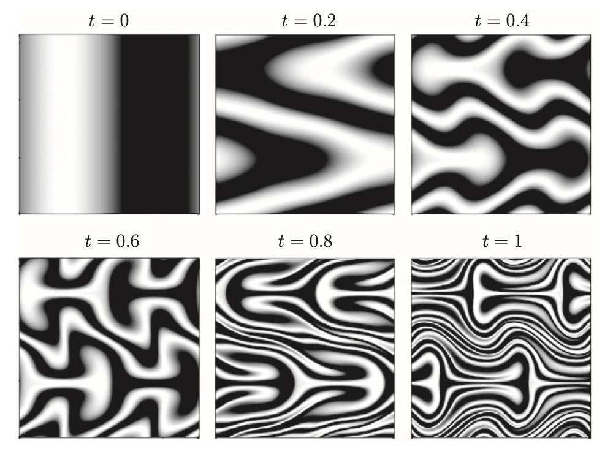

# 固定功率下的演化过程

$$
u_{p}=\frac{1}{\tau}\,\frac{-\Delta^{-1}\mathrm{P}(\theta\nabla\varphi)}{\|\nabla^{-1}\mathrm{P}(\theta\nabla\varphi)\|_{L^2}}
$$

**初始信息：**$\theta=sin(\pi x), \quad \Omega =[-1,1]^2, \quad \tau = 0.5, \quad T = 8$

**演化图像：**从0开始，每0.5s记录一张图，最终记录的时间为7.5s

    
    
  	
  	

    
    
  	
  	

    
    
  	
  	

    
    
  	
  	

**周期性边界下结果：**

**对比：**粗略来看，只达到了周期下0.6-0.8下的精度（再往下算，误差更大...)，非周期下的混合，无法通过外流的形式，让高密度流尽快的融入到低密度的流中。最开始，非周期边界条件下的流，是一种类似旋转的流，从整体上有高密度流向低密度，之后的才慢慢在局部进一步细化。（这写的是啥......

**非周期下相关范数演化：**

